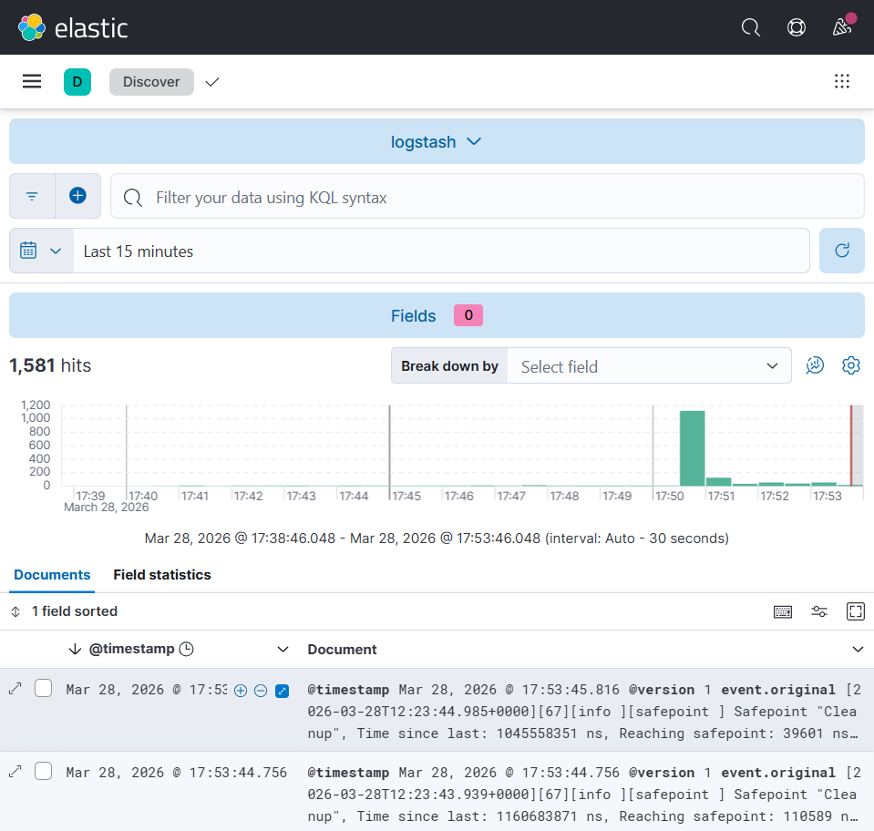
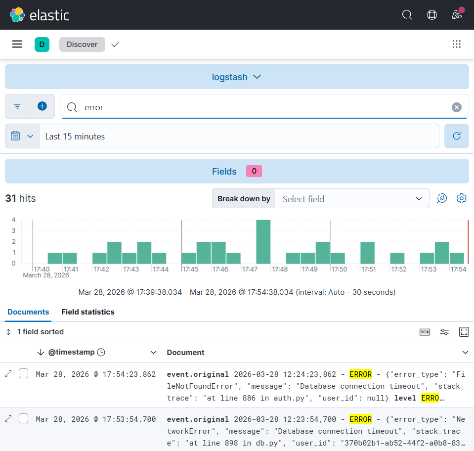
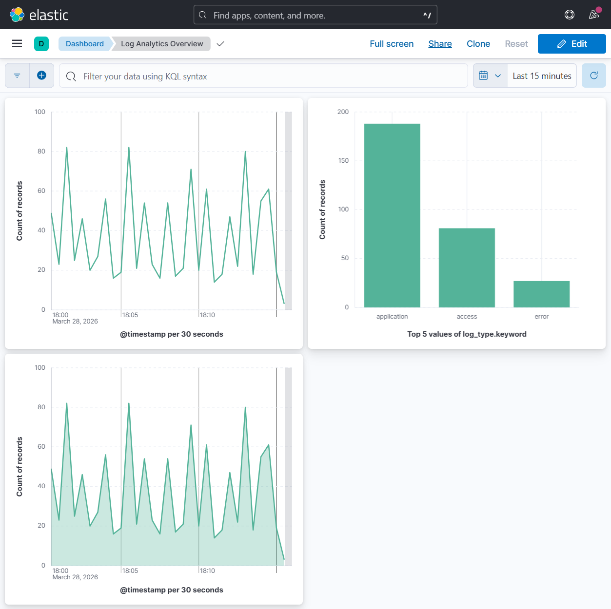

# Log Analytics Project

A complete log analytics solution using Elasticsearch, Kibana, Docker, and Kubernetes.

## 🏗️ Architecture

- **Elasticsearch**: Search and analytics engine for log storage
- **Kibana**: Data visualization and exploration platform
- **Logstash**: Log processing pipeline
- **Filebeat**: Log shipping agent
- **Docker**: Containerization platform
- **Kubernetes**: Container orchestration
- **Python App**: Log generator for testing

## 📁 Project Structure

```
log_analytics_project/
├── docker-compose.yml          # Docker Compose configuration
├── Dockerfile                  # Application container
├── requirements.txt            # Python dependencies
├── log_generator.py           # Log generation application
├── setup.sh                   # Docker setup script
├── k8s-setup.sh              # Kubernetes setup script
├── filebeat/
│   └── filebeat.yml          # Filebeat configuration
├── logstash/
│   ├── config/
│   │   └── logstash.yml      # Logstash configuration
│   └── pipeline/
│       └── logstash.conf     # Pipeline configuration
├── k8s/
│   ├── namespace.yaml        # Kubernetes namespace
│   ├── elasticsearch.yaml   # Elasticsearch deployment
│   ├── kibana.yaml          # Kibana deployment
│   └── app.yaml             # Application deployment
└── logs/                     # Generated log files
```

## 🚀 Quick Start

### Option 1: Docker Compose (Recommended for Development)

1. **Clone and setup the project:**
   ```bash
   git clone <your-repo-url>
   cd log_analytics_project
   chmod +x setup.sh
   ./setup.sh
   ```

2. **Access the services:**
   - Kibana: http://localhost:5601
   - Elasticsearch: http://localhost:9200

### Option 2: Kubernetes with Minikube

1. **Prerequisites:**
   ```bash
   # Install minikube and kubectl if not already installed
   # Start minikube
   minikube start --memory=4096 --cpus=2
   ```

2. **Deploy to Kubernetes:**
   ```bash
   chmod +x k8s-setup.sh
   ./k8s-setup.sh
   ```

3. **Access services:**
   ```bash
   # Port forward to access services
   kubectl port-forward svc/kibana-service 5601:5601 -n log-analytics
   kubectl port-forward svc/elasticsearch-service 9200:9200 -n log-analytics
   ```

## 📊 Using Kibana

1. **Open Kibana:** http://localhost:5601

2. **Create Index Patterns:**
   - Go to Stack Management > Index Patterns
   - Create pattern for `filebeat-*`
   - Create pattern for `logstash-*`
   - Set `@timestamp` as the time field

3. **Explore Data:**
   - Go to Discover to explore logs
   - Create visualizations in Visualize
   - Build dashboards in Dashboard

## 📈 Project in Action

### 🔍 Log Discovery
View all ingested logs in real-time within the Kibana Discover tab.


### 🚨 Error Analysis
Easily filter and analyze error logs to troubleshoot application issues.


### 📊 Log Analytics Dashboard
A comprehensive overview of log trends, distributions, and metrics.


## 📈 Sample Queries

### Elasticsearch Queries

```bash
# Check cluster health
curl -X GET "localhost:9200/_cluster/health?pretty"

# List all indices
curl -X GET "localhost:9200/_cat/indices?v"

# Search logs
curl -X GET "localhost:9200/filebeat-*/_search?pretty" -H 'Content-Type: application/json' -d'
{
  "query": {
    "match": {
      "log_type": "error"
    }
  },
  "size": 10
}'
```

### Kibana Query Examples

```
# Find error logs
log_type: "error"

# Find specific user activity
user_id: "john_doe" AND action: "login"

# Find high response time
response_time: >1000

# Time range queries
@timestamp: [now-1h TO now]
```

## 🛠️ Troubleshooting

### Common Issues

1. **Elasticsearch not starting:**
   ```bash
   # Check memory settings
   docker-compose logs elasticsearch
   # Increase Docker memory if needed
   ```

2. **Kibana connection refused:**
   ```bash
   # Wait for Elasticsearch to be ready
   curl -X GET "localhost:9200/_cluster/health"
   ```

3. **No logs appearing:**
   ```bash
   # Check log generator
   docker-compose logs app
   
   # Check filebeat
   docker-compose logs filebeat
   ```

4. **Kubernetes pods not starting:**
   ```bash
   # Check pod status
   kubectl get pods -n log-analytics
   
   # Check pod logs
   kubectl logs deployment/elasticsearch -n log-analytics
   ```

### Useful Commands

```bash
# Docker Compose
docker-compose up -d              # Start services
docker-compose down              # Stop services
docker-compose logs -f           # View logs
docker-compose restart          # Restart services

# Kubernetes
kubectl get pods -n log-analytics                    # List pods
kubectl logs deployment/log-generator -n log-analytics  # View app logs
kubectl describe pod <pod-name> -n log-analytics    # Pod details
kubectl delete namespace log-analytics              # Clean up
```

## 🔧 Configuration

### Environment Variables

- `ES_JAVA_OPTS`: Elasticsearch JVM options
- `LS_JAVA_OPTS`: Logstash JVM options
- `ELASTICSEARCH_HOSTS`: Elasticsearch connection string

### Volume Mounts

- `./logs`: Application log files
- `esdata`: Elasticsearch data persistence
- Configuration files mounted as read-only

## 📚 Learning Resources

### Elasticsearch
- [Official Documentation](https://www.elastic.co/guide/en/elasticsearch/reference/current/index.html)
- [Query DSL](https://www.elastic.co/guide/en/elasticsearch/reference/current/query-dsl.html)

### Kibana
- [User Guide](https://www.elastic.co/guide/en/kibana/current/index.html)
- [Visualizations](https://www.elastic.co/guide/en/kibana/current/dashboard.html)

### Docker
- [Docker Compose](https://docs.docker.com/compose/)
- [Best Practices](https://docs.docker.com/develop/dev-best-practices/)

### Kubernetes
- [Kubernetes Basics](https://kubernetes.io/docs/tutorials/kubernetes-basics/)
- [Minikube](https://minikube.sigs.k8s.io/docs/)

## 🤝 Contributing

1. Fork the repository
2. Create a feature branch
3. Make your changes
4. Test thoroughly
5. Submit a pull request

## 📄 License

This project is open source and available under the [MIT License](LICENSE).